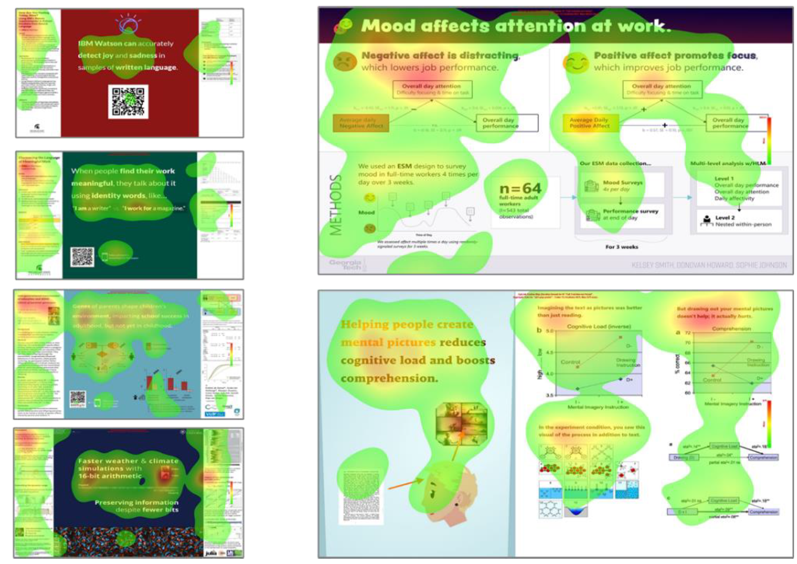
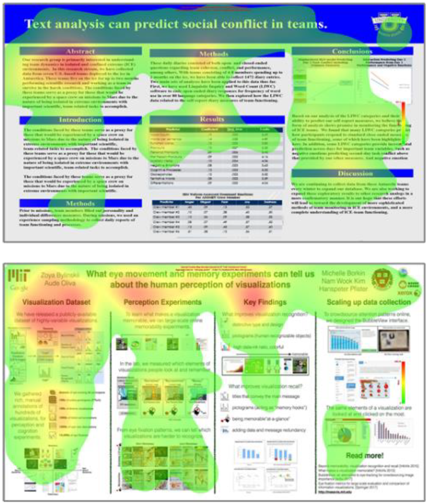

---


abstract: |
    Every academic is confronted with the need to stay on top of trends and advancements within their
    field and to detect those aspects and involved researchers that help their own research progress and
    vice versa. One important path to that end is scanning the posters during poster sessions at
    academic conferences efficiently and effectively. By applying eye tracking technology to various
    academic poster designs, this exploratory experimental study aims to reveal how design choices
    foster or hinder information collection during poster sessions.

    The eye tracking experiment was conducted using an eyelink 1000 Pro. Eight academic posters were
    presented on screen, 20 sec. each, en bloc, but in randomized order. The test persons were thirteen
    academics. Time to search for the desired information, findability of relevant messages, as well as
    cognitive load during the information collection process were examined.

    Putting all limitations aside (e.g. n=13, arbitrary stimuli selection and AOI definition, missing baseline
    corrections, large individual differences), results show, that reduction of content (as inherent to
    #betterposter design) forced the gaze to the main parts of the poster. But it was only the landscape
    layout of #betterposter v2 design, that attracted all participants to look at all relevant parts and it’s
    been the “Presenter Mode” of #betterposter v2 design, that best matched the gaze sequence,
    established in western culture (top left as starting point). Both findings are supported by
    corresponding good ratings in questionnaire. Therefore the #betterposter v2 “Presenter Mode” is
    recommended for use.

    This pilot study expanded the knowledge on information collection and cognitive load, that is of
    growing importance with the increasing amount of research produced. This pilot study enabled the
    author to learn dos and don'ts, compile recommendations, and collect what to consider when
    conducting the next eye tracking experiments on academic poster design.

bibliography:
  - references.bib
---

## Video results
:::{iframe} https://www.youtube.com/embed/To7Hoa8KftE
:width: 100%
Eye tracked scientific posters
:::


## Introduction

As Mike Morrison has pointed a out ([Morrison, 2020](https://www.youtube.com/watch?v=SYk29tnxASs)), the way how academic posters are presented has not changed during the last 30 years, although research has advanced. To tackle our global problems, help research advancing, and prevent research from being ineffective and ignored, we need new ways to communicate research results and ideas ([Morrison, 2020](https://www.youtube.com/watch?v=SYk29tnxASs); [Morrison, Merlo, and Woessner, 2020](https://doi.org/10.1016/j.cell.2020.07.029); [Oronje et al., 2022](https://doi.org/10.32388/P7N5BO); [Rowe & Ilic, 2015](https://doi.org/10.1111/febs.13383); [Ilic & Rowe, 2013](https://doi.org/10.1111/hir.12015)). That was and is the motivation of Mike Morrison, who in 2019 created and presented the first #betterposter design and sparked a movement ([Morrison, 2019](https://www.youtube.com/watch?v=WBjhxjWDiHw)).

By applying digital tools (eg QR codes pointing to a full paper that is documenting the research process and/or linking to all resources, necessary to reproduce the study, as required e.g. by the [Guidelines for Good Scientific Practice of the Austrian Agency for Research Integrity (2015)](https://oeawi.at/en/guidelines/#:~:text=All%20persons%20involved%20in%20research,junior%20scientists/researchers%20in%20particular.), the academic posters’ content may be reduced to the most important messages ([Morrison et al., 2020](https://doi.org/10.1016/j.cell.2020.07.029)). By further applying findings of UI/UX design and psychological research on communication and information foraging theory ([Pirolli & Card, 1999](https://doi.org/10.1037/0033-295X.106.4.643); [Mayer & Moreno, 2003](https://doi.org/10.1207/S15326985EP3801_6)), academic posters may be designed, that are faster and easier to understand and thus better serve their purpose of spreading knowledge.

By means of eye tracking technology, this exploratory experimental study aims at revealing how design choices foster or hinder information collection. Various academic poster designs are examined regarding time and effort to search for the desired information, as well as cognitive load expressed during the information collection process. The findings shall inform the next #betterposter design, supporting research and academics with user experience (UX) tested communication and sharing facilities, better adjusted to the increasing amount of research produced.


## Methods

Eye tracking technology is used to locate and follow a person’s gaze while looking at objects. Since it is difficult to look at something and think about something different, the focus of the eye is often equated with the focus of the brain ([Krasich et al., 2020](https://doi.org/10.1167/jov.20.9.10)). This may be observed by a changing focus and altered gaze traces, when the tasks given to the participants change ([Buswell, 1935](https://psycnet.apa.org/record/1935-05800-000), p. 136 and [Yarbus, 1967](https://link.springer.com/book/10.1007/978-1-4899-5379-7), p. 174).

1 „traditional scientific posters received an average of 6.4 visitors, according to presenters’ own subjective count” ([Morrison, Merlo, and Woessner, 2020](https://doi.org/10.1016/j.cell.2020.07.029))

In user experience testing the think-aloud approach2, observation, questionnaires, as well as eye tracking technology, and combinations are used ([Bojko, 2013](https://books.google.com/books?hl=en&lr=&id=cHo3DwAAQBAJ&oi=fnd&pg=PR3&dq=Eye+Tracking+the+User+Experience:+A+Practical+Guide+to+Research.+New+York&ots=8cSGuOqp_4&sig=CzGMaVCYgcwI0TygHfNIqj92nnc). P. 106). Eye tracking is used to a smaller degree, since it requires expensive equipment and trained personnel. Eye tracking delivers high-precision measurements and outcomes, that in general are not necessary for most applications in UX testing ([Bojko 2013](https://books.google.com/books?hl=en&lr=&id=cHo3DwAAQBAJ&oi=fnd&pg=PR3&dq=Eye+Tracking+the+User+Experience:+A+Practical+Guide+to+Research.+New+York&ots=8cSGuOqp_4&sig=CzGMaVCYgcwI0TygHfNIqj92nnc), p. 44). The current study relies on eye tracking technology based on the fact, that cognitive load3 may be reliably measured by the participants’ pupil size and average fixation duration, and this was key in the context of this study.


### Study Design

Following Aga Bojko's ([Bojko, 2013](https://books.google.com/books?hl=en&lr=&id=cHo3DwAAQBAJ&oi=fnd&pg=PR3&dq=Eye+Tracking+the+User+Experience:+A+Practical+Guide+to+Research.+New+York&ots=8cSGuOqp_4&sig=CzGMaVCYgcwI0TygHfNIqj92nnc), p. 124ff) UX procedure, mental workload and cognitive processes (providing insights on how easy /difficult the message was to convey) were measured by pupil diameter and average fixation duration; effective target identification (disclosing how well topic and results are presented) were determined by the percentage of test persons that fixated on AOIs, efficiency by the number of fixations and timespan, before the first fixation on any of the targets (AOI) took place.

As proposed by Aga Bojko ([Bojko, 2013](https://books.google.com/books?hl=en&lr=&id=cHo3DwAAQBAJ&oi=fnd&pg=PR3&dq=Eye+Tracking+the+User+Experience:+A+Practical+Guide+to+Research.+New+York&ots=8cSGuOqp_4&sig=CzGMaVCYgcwI0TygHfNIqj92nnc), p. 80), a within-subjects4 approach was chosen, carryover effects were controlled by stimuli presented in randomized order.


### Experiment Setup

The experiment took place at the MediaLab of the University of Vienna, November 23<sup>rd</sup> 2022, in the afternoon. The experiment was conducted in a separated, quiet room with two persons present: the experimenter on the one hand, an experienced member of the MediaLab who supervised the whole procedure, including the calibration, and the participant on the other hand.

Each of them was sitting in front of a computer, the two desks were separated, with no visual contact between the persons present.

The heads of the participants were not fixed (no chinrest), but freely moveable. Three different blocs of stimuli were presented to every participant, every stimulus for 20 seconds. The data collection process (including introduction and calibration) took about 10 minutes per participant. After the data collecting process, the participants filled in a questionnaire in a separate room with the stimuli presented as printouts, recording their ratings regarding understandability and how much they liked the overall appearance of the various posters (Likert Scale 1-5).

2 “In a concurrent verbal protocol (CVP, also known as the “think-aloud protocol”), participants articulate their thoughts in real time during the execution of a task.” ([Bojko, 2013](https://books.google.com/books?hl=en&lr=&id=cHo3DwAAQBAJ&oi=fnd&pg=PR3&dq=Eye+Tracking+the+User+Experience:+A+Practical+Guide+to+Research.+New+York&ots=8cSGuOqp_4&sig=CzGMaVCYgcwI0TygHfNIqj92nnc), p. 106ff)

3 Cognitive Load can be assessed by performance measures (e.g. time spent on task and scores achieved), subjective rating on task difficulty, and psychophysical tools, e.g. eye tracking, with longer fixation duration and increased pupil dilation as signs for higher cognitive load ([Katona, 2022](https://doi.org/10.3390/s22030912); [Holmqvist, 2011](https://www.researchgate.net/publication/323779800_Eye-tracking_A_comprehensive_guide_to_methods_paradigms_and_measures), p. 393ff)

4 In within-subjects study designs all participants are exposed to all tested stimuli ([Bojko, 2013](https://books.google.com/books?hl=en&lr=&id=cHo3DwAAQBAJ&oi=fnd&pg=PR3&dq=Eye+Tracking+the+User+Experience:+A+Practical+Guide+to+Research.+New+York&ots=8cSGuOqp_4&sig=CzGMaVCYgcwI0TygHfNIqj92nnc), p. 79).

The eye tracking experiment was conducted using an Eyelink 1000 Pro with a data sample size of ~1000 data points per second. In total more than two million data points were collected and analyzed.

The data sets, derived from the Eyelink 1000 Pro eyetracking system, were compiled, analyzed, and visualized in R (R version 4.2.2 (2022-10-31 ucrt) -- "Innocent and Trusting"), as provided by the [R Core Team](https://www.R-project.org/), together with the documentation of the research process, using the IDE RStudio/Posit ([RStudio Team, 2020](http://www.rstudio.com/); [Posit team, 2022](http://www.posit.co/)) and [RMarkdown](https://rmarkdown.rstudio.com).


### Measurements

In this experiment academic posters were investigated by using seven measurements associated with four categories: cognitive load, efficiency, effectivity, subjective ratings/opinions.

Signs of cognitive load were measured by the average fixation duration and by pupil size ([Bojko, 2013](https://books.google.com/books?hl=en&lr=&id=cHo3DwAAQBAJ&oi=fnd&pg=PR3&dq=Eye+Tracking+the+User+Experience:+A+Practical+Guide+to+Research.+New+York&ots=8cSGuOqp_4&sig=CzGMaVCYgcwI0TygHfNIqj92nnc), pp. 36, 96, 135 and [Holmqvist et al., 2011](https://www.researchgate.net/publication/323779800_Eye-tracking_A_comprehensive_guide_to_methods_paradigms_and_measures), p. 381ff), targeting relevant information (effectivity) was measured as percentage of participants, who fixated all relevant parts of the posters (defined as Area of Interest) at least once ([Bojko, 2013](https://books.google.com/books?hl=en&lr=&id=cHo3DwAAQBAJ&oi=fnd&pg=PR3&dq=Eye+Tracking+the+User+Experience:+A+Practical+Guide+to+Research.+New+York&ots=8cSGuOqp_4&sig=CzGMaVCYgcwI0TygHfNIqj92nnc), p. 127ff), efficiency was measured by counting fixation steps to target (relevant messages predefined as AOI area of interest) and time to target ([Bojko, 2013](https://books.google.com/books?hl=en&lr=&id=cHo3DwAAQBAJ&oi=fnd&pg=PR3&dq=Eye+Tracking+the+User+Experience:+A+Practical+Guide+to+Research.+New+York&ots=8cSGuOqp_4&sig=CzGMaVCYgcwI0TygHfNIqj92nnc), p. 126f). Opinions and ratings were collected via a questionnaire.


### Participants

Participants were four members of the MediaLab and nine participants of the university course “Introduction to Eye Tracking”, 13 in total, all academics. They were introduced to the experiment setting, did a calibration run and watched the stimuli with no task assigned.

Their experiences with the #betterposter initiative, posters and poster sessions at conferences differed greatly: 11 participants had never heard of, 1 was unsure, 1 (the author) was familiar with #betterposter design; 7 have already created poster(s) themselves; 4 participants have never been at academic conferences, 7 have attended 1-5 conferences, 2 have attended more than 5 conferences.

### Stimuli

Eight academic posters were used as stimuli ({numref}`poster-stimuli`): two related to the traditional poster layout, two in #betterposter version 1 design, two in text-only #betterposter version 1 design, two in #betterposter version 2 design, all in landscape format. They stem from various fields of research.

## Results

The averages of the measures of the 13 participants are displayed in tabular form ({numref}`measurement-table`) and are shown in overview as parallel coordinates chart in {numref}`parallel-coorinates`. The data in this chart are normalized, a procedure that allows to compare data with disparate sizes and units, as created by eye tracking. The results back the assumption, that the most recent version of #betterposter design (posters 1 and 2, {numref}`poster-stimuli`) work best in comparison.

#### Cognitive Load

Larger pupil diameter and longer fixation duration are associated with higher cognitive load ([Bojko, 2013](https://books.google.com/books?hl=en&lr=&id=cHo3DwAAQBAJ&oi=fnd&pg=PR3&dq=Eye+Tracking+the+User+Experience:+A+Practical+Guide+to+Research.+New+York&ots=8cSGuOqp_4&sig=CzGMaVCYgcwI0TygHfNIqj92nnc), pp. 36, 96, 135; [Galley et al., 2015](https://doi.org/10.13140/RG.2.1.3128.1769); and [Holmqvist et al., 2011](https://www.researchgate.net/publication/323779800_Eye-tracking_A_comprehensive_guide_to_methods_paradigms_and_measures), p. 381ff). Low measures in both aspects for #betterposter version 2 indicate easy to grasp and easy to process information.

Regarding fixation duration the #betterposter version 2 designs are ranked first and third in this aspect ({numref}`measurement-table`, {numref}`parallel-coorinates`). In pupil size #betterposter version 2 designs are ranked first and fourth ({numref}`measurement-table`, {numref}`parallel-coorinates`).

#### Efficiency

Efficiency measured as steps2target (number of fixations) and time2target (in milliseconds) till the first fixation within any area of interest takes place, results in #betterforest version 2 designs ranked first and fourth (both measurements are highly correlated). Overall, five out of eight posters score quite low in this aspect ({numref}`measurement-table`, {numref}`parallel-coorinates`), indicating that at least one area of interest is looked at quite quickly ({numref}`bar-chart` suggests this to be the title text).

#### Effectivity
:::{note} Takeaway
"Only #betterposter version 2 designs attracted all participants to look at all relevant parts of the posters..."
:::


Regarding effectivity only #betterposter version 2 designs attracted all participants to look at all relevant parts of the posters ({numref}`measurement-table`, {numref}`parallel-coorinates`). Although all participants looked at all posters undisturbed for 20 seconds, relevant parts of the other posters were not even looked at ({numref}`bar-chart`).

#### Questionnaire

Results derived from analyzing the questionnaire show as well high scores for #betterposter version 2 designs: regarding understandability of the results, they were ranked first and fourth, regarding overall appearance they were ranked first and third ({numref}`measurement-table`, {numref}`parallel-coorinates`).


## Discussion

As Aga Bojko ([Bojko, 2013](https://books.google.com/books?hl=en&lr=&id=cHo3DwAAQBAJ&oi=fnd&pg=PR3&dq=Eye+Tracking+the+User+Experience:+A+Practical+Guide+to+Research.+New+York&ots=8cSGuOqp_4&sig=CzGMaVCYgcwI0TygHfNIqj92nnc), p. 123) reminds us "interpretation depends on goals and stimuli". Therefore, we have to mention, that one (of the many) limitation of this pilot study is associated with poor experiment design, e.g. not providing tasks (what to watch for) for the participants, - something that changes significantly the way how an image is looked at, as already pointed out by Alfred Yarbus ([Yarbus, 1967](https://link.springer.com/book/10.1007/978-1-4899-5379-7), pp. 171 ff.). As the raincloud plots ({numref}`raincloud-plot` and {numref}`raincloud-plot-pupils`) for average fixation duration and pupil size show, the measures of the 13 participants are widespread, this holds true for the other measures including the questionnaire as well. An additional hint, why we may not conclude from this small sample to a larger population.

A non-exhaustive list of things to consider for the next study is listed in the section Conclusion and Next Steps.

Regarding the treatment and interpretation of measures, derived from EyeLink 1000 Pro, here some criticism:

Results in averages of fixation duration might not be as significant, as they are (almost all) situated within the normal range for reading (200 -250 ms according to [Bojko, 2013](https://books.google.com/books?hl=en&lr=&id=cHo3DwAAQBAJ&oi=fnd&pg=PR3&dq=Eye+Tracking+the+User+Experience:+A+Practical+Guide+to+Research.+New+York&ots=8cSGuOqp_4&sig=CzGMaVCYgcwI0TygHfNIqj92nnc), p. 135 and 200 ms for light fiction and 260 ms for texts on biology and physics according to [Holmqvist et al., 2011](https://www.researchgate.net/publication/323779800_Eye-tracking_A_comprehensive_guide_to_methods_paradigms_and_measures), p. 382), but looking at the gaze signature ({numref}`gaze-signature`) depicting the number of fixations and their duration as timelines, we see spikes up to 500 – 700 ms (even much higher spiking for other posters). There is also evidence ([Holmqvist et al., 2011](https://www.researchgate.net/publication/323779800_Eye-tracking_A_comprehensive_guide_to_methods_paradigms_and_measures), p. 383) that shorter fixation duration may occur with high stress levels, - an additional measure e.g. [NASA Task Load Index [TLX]](https://humansystems.arc.nasa.gov/groups/TLX/) needs to be applied to make the distinction.

Pupil size, a highly idiosyncratic measure ([Bojko, 2013](https://books.google.com/books?hl=en&lr=&id=cHo3DwAAQBAJ&oi=fnd&pg=PR3&dq=Eye+Tracking+the+User+Experience:+A+Practical+Guide+to+Research.+New+York&ots=8cSGuOqp_4&sig=CzGMaVCYgcwI0TygHfNIqj92nnc), p. 131 and [Holmqvist et al., 2011](https://www.researchgate.net/publication/323779800_Eye-tracking_A_comprehensive_guide_to_methods_paradigms_and_measures), p. 393) needs a special experiment set-up (scrambled pictures for brightness adjustments) and a different treatment of resulting data (no merging all participants averages into one average, but calculating individual baselines, measuring differences, and building rankings).

Steps2target and time2target as well show widespread data, it is recommended to measure these for all AOIs of a poster separately (not just for the one, that is looked at first).

Effectivity is the only category for which this study provides a clear and unquestionable outcome: only #betterposter design version 2 designs attract all participants to look at all areas of interest ({numref}`bar-chart`). This result most probably is caused by radical de-cluttering of the vers. 2 posters, an effect, that might be observed by comparing the heatmaps ({numref}`heatmaps`) of all posters, but although the #betterposter version 2 designs are extremely reduced, there are still parts outside the AOIs that are looked at, as shown by the participants’ gaze signatures of poster n°2 ({numref}`gaze-signature`). Effectivity measures shall include dwell time in future experiments.

Questionnaire data again show large individual differences, providing no indications for generalization.


## Conclusion and Next Steps

This exploratory experimental pilot study shows promising ways to answer pressing questions regarding better research communication with academic posters and has detected and explicated many shortcomings in experiment design, analysis, and interpretation of results.

Subsequent experiments shall consider (non-exhaustive list):

- Stimuli shall be tailored, so that the same topic, the same research is presented in all poster design versions studied. This will help to rule out topic related interests. Number of posters need to be increased significantly. As an example, three poster designs representing this paper’s results are shown in the appendix.

- AOIs need to be defined based on careful consideration (size of AOIs influencing result, additional interviews with experts: what is necessary for the decision, whether research presented on poster is important and worthwhile to download and read the paper?).

- Dwell time on AOI needs to be studied (the current study only determined whether or not an AOI was looked at, but did not analyze how long the participants looked at the AOIs).

- Participants need to represent experts (attended many conferences and have created many posters), intermediates, and newcomer (unexperienced) to the field. This will help to determine, whether experience compensates bad design and favors traditional design in general and/or tends to reject unfamiliar poster designs as inconvenient. In addition, an item in the questionnaire shall inquire the attitude towards poster design. Perhaps an introductory note on the purpose of posters should precede the experiment? Shall participants be able to propose their own work as stimuli and prepare posters in all designs studied or will this cause additional biases?

- Think about confounding factors (e.g. [Holmqvist et al., 2011](https://www.researchgate.net/publication/323779800_Eye-tracking_A_comprehensive_guide_to_methods_paradigms_and_measures)).

- Questionnaire should include questions already used in academic poster studies ([Oronje, Morrison, Suharlim, et al., 2022](https://doi.org/10.32388/P7N5BO)) for comparability.

- Number of participants needs to be increased. 30 participants for every group (experts, intermediates, newcomer)? How to define necessary sample size is explained by [Bojko (213, p. 156 ff)](https://books.google.com/books?hl=en&lr=&id=cHo3DwAAQBAJ&oi=fnd&pg=PR3&dq=Eye+Tracking+the+User+Experience:+A+Practical+Guide+to+Research.+New+York&ots=8cSGuOqp_4&sig=CzGMaVCYgcwI0TygHfNIqj92nnc).

- Prevent participants from getting tired by watching too many posters in a single set. Allow for breaks, do fatigue assessments. Set-up measures to identify stress-induced short fixation duration. Add subjective assessments of workload for comparison, e.g. the [NASA Task Load Index (TLX)](https://humansystems.arc.nasa.gov/groups/TLX/) as proposed by [Bojko (2013, p. 35)](https://books.google.com/books?hl=en&lr=&id=cHo3DwAAQBAJ&oi=fnd&pg=PR3&dq=Eye+Tracking+the+User+Experience:+A+Practical+Guide+to+Research.+New+York&ots=8cSGuOqp_4&sig=CzGMaVCYgcwI0TygHfNIqj92nnc).

- Include questions for self-reported mind-wandering in questionnaire ([Krasich, 2020](https://doi.org/10.1167/jov.20.9.10)).

- To simulate conference conditions, set up an accompanying study to analyze attention levels and declarative memory function.

- Compare screen based eye tracking with ‘real world’ eye tracking (using glasses and a real or simulated ‘poster session’ environment).

- Task description, - “what to watch” - needs to be added. Simulating the intended behavior at conferences (scanning posters for trends, relevant topics, research to build upon, exchange ideas, knowledge).

- Perhaps kind of a memory test should be included?

- To measure pupil dilation correctly, each and every poster presented on screen needs to be preceded by a scrambled representation (in equal brightness) of the following picture to provide some time for the pupil to adjust (on latency see [Holmqvist et al., 2011 p. 434ff](https://www.researchgate.net/publication/323779800_Eye-tracking_A_comprehensive_guide_to_methods_paradigms_and_measures); for the procedure see [Bojko, 2013, p. 131](https://books.google.com/books?hl=en&lr=&id=cHo3DwAAQBAJ&oi=fnd&pg=PR3&dq=Eye+Tracking+the+User+Experience:+A+Practical+Guide+to+Research.+New+York&ots=8cSGuOqp_4&sig=CzGMaVCYgcwI0TygHfNIqj92nnc)).

- Because of large individual variability and idiosyncrasies ([Bojko, 2013, p. 131](https://books.google.com/books?hl=en&lr=&id=cHo3DwAAQBAJ&oi=fnd&pg=PR3&dq=Eye+Tracking+the+User+Experience:+A+Practical+Guide+to+Research.+New+York&ots=8cSGuOqp_4&sig=CzGMaVCYgcwI0TygHfNIqj92nnc) and [Holmqvist 2011, p. 393](https://www.researchgate.net/publication/323779800_Eye-tracking_A_comprehensive_guide_to_methods_paradigms_and_measures)), the pupil size in particular may not be calculated as average of averages but needs to be assessed as rank for each participant in a within-subject design, where “each participant serves as her own baseline” ([Bojko, 2013, p. 80](https://books.google.com/books?hl=en&lr=&id=cHo3DwAAQBAJ&oi=fnd&pg=PR3&dq=Eye+Tracking+the+User+Experience:+A+Practical+Guide+to+Research.+New+York&ots=8cSGuOqp_4&sig=CzGMaVCYgcwI0TygHfNIqj92nnc)).

- Calculate baselines for each measurement as proposed by [Bojko, 2013, p. 131](https://books.google.com/books?hl=en&lr=&id=cHo3DwAAQBAJ&oi=fnd&pg=PR3&dq=Eye+Tracking+the+User+Experience:+A+Practical+Guide+to+Research.+New+York&ots=8cSGuOqp_4&sig=CzGMaVCYgcwI0TygHfNIqj92nnc) and Holmqvist (2011, p. 393) for pupil size. “Since most eye tracking measures are highly idiosyncratic, the change between baseline value (looking at the scrambled picture for pupil diameter) and the value derived from looking at the stimulus itself, shall be used as measurement” ([Bojko, 2013, p. 131](https://books.google.com/books?hl=en&lr=&id=cHo3DwAAQBAJ&oi=fnd&pg=PR3&dq=Eye+Tracking+the+User+Experience:+A+Practical+Guide+to+Research.+New+York&ots=8cSGuOqp_4&sig=CzGMaVCYgcwI0TygHfNIqj92nnc)).

- Combine pupil size with measures of blink rate, blink duration, fixation durations, saccadic extent, fixation rate, and dwell time as proposed by [Holmqvist 2011, p. 393](https://www.researchgate.net/publication/323779800_Eye-tracking_A_comprehensive_guide_to_methods_paradigms_and_measures) to better estimate cognitive requirements of a task.

- Efficiency should be defined as “how fast are all AOIs visited” and/or calculate measure for each AOI separately for more meaningful data.

- Present heatmaps inverted: transform red areas (watched intensely) into clearly visible spots and make lesser watched to totally neglected areas invisible with a grey-to-black layer. This will clarify the results by showing only those parts, that were looked at and recognized, whereas the rest disappears in darkness.

- Data should be prepared in a way, that everything “good” has a high or low level (no mix, - this leads to confusion, esp. in visualizations).

- Add concurrent think-aloud verbal protocols (CVP) (cave: adds extra cognitive workload!) or Retrospective Verbal Protocol (RVP) as described by [Bojko, 2013, p. 108](https://books.google.com/books?hl=en&lr=&id=cHo3DwAAQBAJ&oi=fnd&pg=PR3&dq=Eye+Tracking+the+User+Experience:+A+Practical+Guide+to+Research.+New+York&ots=8cSGuOqp_4&sig=CzGMaVCYgcwI0TygHfNIqj92nnc) for comparison and/or to get additional insights on information processing. Review [Holmqvist 2011, p. 295](https://www.researchgate.net/publication/323779800_Eye-tracking_A_comprehensive_guide_to_methods_paradigms_and_measures) on triangulating eye-movement data with verbal data).

- Research, whether studies have already shown that negative words and those indicating conflict and dissent (negative, no, none, not, in-, un-, dis-, etc.) and subclauses with but, although, except, etc. evoke higher attention (emotional arousal, alert?). The same for graphs and diagrams with crossing lines (including segmented bar charts), with and without alarming colors (red, orange, yellow).


## Figures & Tables

:::{table} Measurements
:label: measurement-table


| postID  | avgFixDur | avgPupilSize | steps2target | time2target | percOnAOI | quest_results | quest_appear |
|---------|-----------|--------------|--------------|-------------|-----------|---------------|--------------|
| bpv1_p03| 233.63    | 399.84       | 5.31         | 1095.00     | 69.25     | 2.92           | 2.77         |
| bpv1_p05| 232.86    | 425.64       | 0.31         | 32.08       | 96.00     | 1.92           | 2.08         |
| bpv2_p01| 217.25    | 369.19       | 0.62         | 85.62       | 100.00    | 3.54           | 2.85         |
| bpv2_p02| 208.64    | 384.18       | 0.31         | 12.08       | 100.00    | 4.46           | 3.69         |
| bv1t_p06| 213.91    | 414.33       | 0.46         | 59.15       | 92.50     | 4.23           | 2.85         |
| bv1t_p07| 253.60    | 407.40       | 0.69         | 92.15       | 66.67     | 3.69           | 2.77         |
| trad_p04| 231.48    | 376.38       | 2.54         | 495.15      | 74.33     | 1.85           | 2.38         |
| trad_p08| 225.06    | 380.21       | 2.15         | 359.62      | 88.50     | 2.77           | 2.38         |

:::

The table with the measurements shows, that the differences are sometimes quite small and of questionable significance.
Note. Average Fixation Duration (avgFixDur) measures the average of all fixations timespans in milliseconds (not to mix up with dwell time!); Eyelink 1000 Pro provides the Average Pupil Size (avgPupilSize) as value, not related to any unit; Steps2target is derived from counting the number of fixations until the first AOI (any) is reached; Time2target, by taking the average of all participants’ summed up fixation durations until an AOI is reached in milliseconds; Percentages on AOI (percOnAOI) denotes the percentage of the participants who looked at each AOI of the poster (100% = have seen all relevant parts); quest_results is an assessment (given in a separate questionnaire) regarding the understandability of the results on a Likert scale (1= difficult, 5=very easy); quest_appear rates the overall appearance of the poster (how much the participants liked it) on a Likert scale (1=dislike, 5=like very much);


```{figure} images/poster-numbers.png
:label: poster-stimuli
:alt: Different poster designs, numbered.
:align: left

The Stimuli: Poster Material (8+4: traditional poster design, 1+2: #betterposter version 2 designs); 3+5: #betterposter version 1 designs; 7+6 #betterposter version 1 designs text-only)
Note. Original posters are colored and just presented in black and white here; Posters 1 and 2, the “winner” poster designs are marked red and orange in graphs and tables throughout this paper.
```

```{figure} images/figure2-poster-eye-tracking-all-measures.png
:label: parallel-coorinates
:alt: All measures in one chart
:align: left

Parallel Coordinates Chart Depicting all Measurements Shown in {numref}`measurement-table` in Comparison Note. Parallel Coordinate Charts show values as shown in the data table ({numref}`measurement-table`) with all normalized values of one variable lined up vertically and the observations (the posters) connected by wavelike lines horizontally. This connectedness makes it easier to assess ranks and positions in relation. The data are normalized between min = 0 and max = 1. The normalization procedure was provided by the R library(GGally) used.
```


```{figure} images/figure3-bar-chart.png
:label: bar-chart
:alt: Bar chart
:align: left

Bar Chart depicting the number and percentages of participants who looked at the posters’ AOIs. Note: All participants looked at all AOIs of #betterposter version 2 designs. 
Number of participants are shown within the bars, percentages are shown outside the bars. This graph does not indicate though, how long the participants looked at the areas of interest.
```


```{figure} images/raincloud-plot.png
:label: raincloud-plot
:alt: Raincloud plot
:align: left
```
Raincloud Plot Depicting the Average Fixation Duration of Participants as Dots, Centrality Measures, and Density Distributions. Note: The mean value is marked with an “x”. The participants’ values are spread out (except those of poster N°2) and there is an outlier present, that perhaps should have been removed.


```{figure} images/raincloud-plot-pupil-size.png
:label: raincloud-plot-pupils
:alt: Raincloud plot of pupil size
:align: left

Raincloud Plot depicting the Average Pupil Size of participants as dots, Centrality measures, and Density Distributions. Note: The mean value is marked with an “x”. The participants’ values are spread out and there are outliers present, that perhaps should have been removed.
```


```{figure} images/gaze-signatures.png
:label: gaze-signature
:alt: Gaze signatures
:align: left

Gaze Signatures of Participants Watching Poster N° 2 based on Fixation Duration Timelines. Note. Orange are Fixations within AOIs and black those outside AOIs. The duration of the fixations is marked as line (spike=longer duration). This graph was meant to reveal patterns on how easy / difficult the poster content was to digest. The idea was, that good poster design should produce no spikes (shorter fixation duration is associated with lower cognitive load) and should be mostly orange (participants looking at the relevant parts of the poster mostly). Although this poster n°2 (considered the best #betterposter design) does invoke long and unspiked orange line segments (especially in comparison with other posters), it remains unclear (to the author) how to interpret the results.
```

:::{figure}
:label: heatmaps
:align: left

(heatmaps-posters)=




Heatmaps, Depicting the Focal Points for all Poster Designs in Comparison. Note. Red = areas that are looked at most often, no Color = nobody looked at this part of the poster. Compare e.g. poster n° 4 on the lower left side (esp. 3rd column: few to non-views in the result section) with poster n° 1 on the lower right side (all parts visited quite equally).
:::

### Appendix
Academic posters created for this paper’s content in three different designs.
Note: 
a) #betterposter version 2, presenter mode, landscape format: considered best practice (QR code needs to be added), includes summary, call to action. 
b) traditional academic poster layout (template of the University of Vienna): very crowded wall-of-text poster, title not framed as crisp message, but as long and quirky question (many readers presumably will exit at this point). 
c) #betterposter version 2, portrait mode: layout not analyzed within this experiment, but should work in general, besides of still being too crowded, missing: summary and call to action.

## Author's Note
:::{note}
A general introduction in history, technique, and method of eye tracking, the use of technical equipment, and set-up of and conducting the experiment was kindly provided by the MediaLAB of the Faculty of Philological and Cultural Studies at the University of Vienna and it’s director Dr. Jörg Mühlhans. The stimuli were provided and prepared by Mike Morrison, who as well invented, created, and promoted the #betterposter design, based on his own research in the field. In addition Mike recommended literature on the topic. Data analysis and writing of this paper was done by Ruth Pfosser. The authors have no conflicts of interest to disclose. Please note: this paper contains by no means publishable content. This exploratory experimental pilot study was conducted during an university course introducing the eye tracking technology. As a first attempt to implement this method, this study contains errors, flaws, and shortcomings in all relevant parts. As a pilot study it needs replication for objectivity, validity, and reliability. Correspondence concerning this article should be addressed to Ruth Pfosser, University of Vienna. Email: a08245118@univie.ac.at
:::
